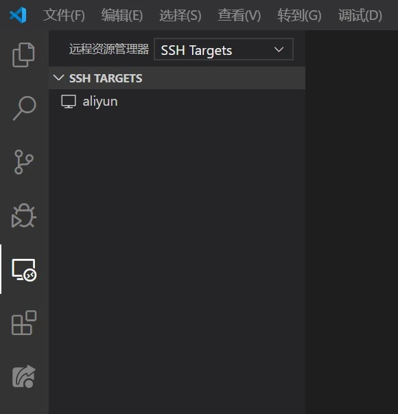

## SSH 代理

从 SSH 说起，基本的使用就不说了，首先介绍它支持的三种代理方式（在 Unix-like 环境下基本都可以用 `man ssh` 查到）。

### 本地代理

```shell
ssh -L [<本机地址>:]<本机端口>:<服务器地址1>:<服务器端口> <用户>@<服务器地址2> [-p <服务器 SSH 端口>]
```

（`<x>` 表示变量，`[x]` 是可选参数）  
`<本机地址>` 默认为 `127.0.0.1` 或 `localhost`  
`<服务器 SSH 端口>` 默认为 `22`

这会将 `<本机地址>:<本机端口>` 网络请求转发到 `<服务器地址1>:<服务器端口>` 。

下面用 MobaXterm 带的 Cygwin 环境看看具体用途：

首先直接 SSH 登录服务器：

```shell
ssh root@baitian.xyz
```

在当前目录新建一个 `index.html` 文件，用来测试 Web 访问，内容如下：

```html
<html><body><h1>Hello Boy!</h1></body></html>
```


启动一个 HTTP 服务：

```python
python3 -m http.server --bind 172.17.0.1 8000
```

这会在 `172.17.0.1:8000` 以当前目录启动 HTTP 服务，我的服务器公网地址是 `baitian.xyz`，但我的服务器无法将 HTTP 服务绑定到这个地址，因为公网地址是云服务器提供商那一层绑定的，我的服务器用 `ip a` 或是 `ifconfig` 等命令都看不到公网地址（如果是直接在公网开启 HTTP 服务，并配置好防火墙规则，是可以直接用公网访问的，其实我用内网 `192.168.1.116` 地址就会直接绑定到公网，当然，这都是提供商做的映射）。


此时，我在本机用地址 <http://172.17.0.1:8000> 访问 HTTP 服务：


其实，这是不该有的操作，`172.*.*.*` 这个是内网地址，不在同一网段是无法直接访问的，但也别太拘泥于什么内网，外网/公网的，本文的目的就是模糊这些，消除访问限制。

开启本地代理：

```shell
ssh -L 8000:172.17.0.1:8000 root@baitian.xyz
```


然后：


这就是本地代理。

(如果按 `<Ctrl + D>` 无法断开 SSH 代理的连接，请先关闭浏览器窗口)

### 反向代理

```shell
ssh -R [<forward ip>:]<forward port>:<local ip>:<local port> <user>@<server> [-p <server SSH port>]
```

和前面的本地代理的区别只是本机和转发的 IP 及端口调换了，也即反向代理，相对地把那个本地代理叫正向代理也成。

这可以将服务器 `<forward ip>:<forward port>` 的请求转发到本机 `<local ip>:<local port>`，但本机一般是 PC，不开什么服务的，所以使用得较本地代理更少，一般就是用来“穿墙”的：登录到学校内部的电脑、公司内部的电脑、操作家里的玩意儿。

下面模拟一下具体使用：


这是我在自己电脑上启动的一个 Ubuntu 容器的网络情况，在没有任何设置的情况下我连不上，包括任何网络请求。由于容器类型设置的 Windows Container，网关也无法访问。


Ubuntu 容器反向代理连接服务器：

```shell
ssh -R 192.168.1.116:8000:127.0.0.1:22 root@baitian.xyz
```


确保服务器的 8000 端口没有被防火墙拦截，最简单的方式是（但是得安装 ufw，没有的话可以用 iptables；如果是云服务器/VPS 的话，厂商可能还存在一层防火墙，注意在服务器后台管理设置相应安全组规则）：

```shell
ufw allow 8000
```

以及服务器的 SSH 配置 `/etc/ssh/sshd_config` 存在以下配置（修改配置后得重启 SSH 服务）：

```shell
GatewayPorts yes
```

此时便可通过服务器连接到 Ubuntu 容器：

```shell
ssh root@baitian.xyz -p 8000
```

(注：我的服务器内网地址 `192.168.1.116` 是直接和公网地址 `baitian.xyz` 在上层映射的，Ubuntu 容器要么配置允许 root 用户密码登录并设置密码，要么设置秘钥对登录。)


### 动态端口映射（Socks 代理）

```shell
ssh -D [<local ip>:]<local port> <user>@<server> [-p <server SSH port>]
```

这会在本地 `<local ip>:<local port>` 开启一个 Socks 5 代理，代理服务器为 SSH 连接的服务器。

再看本地代理中的例子：

开启 Socks 代理：

```shell
ssh -D 1080 root@baitian.xyz
```

本地 `127.0.0.1:1080` 为 Socks 5 代理。

开启 HTTP 服务：

```shell
python3 -m http.server --bind 192.168.1.116 8001
```


浏览器配置代理：

- Microsoft Edge (Chromium)


- Google Chrome


- Mozilla Firefox


不建议命令行那么使用代理，命令行那样启动的话，比如 Chrome，得先把 Chrome 的所有窗口关掉，Edge 也是（这里是新版的 Edge，和 Chrome 差不多，旧版 Edge 在更新的 Windows 10 会消失），有条件可以使用 SwitchyOmega 插件（需要 FQ）。

## 远程桌面

### SSH X Server/Client

我以前对这个的客户端和服务端的理解是反的，其实这一套里面自己的 PC 一般充当服务端，服务器充当客户端，服务器调用 PC 的服务。

所以，直接使用原生 SSH 提供的 X（可以叫 X11）转发的话 PC 需要安装 X Server，可以安装 [VcXsrv](https://sourceforge.net/projects/vcxsrv/)，安装好后启动。先设置好 `DISPLAY` 环境变量，然后 SSH 连接服务器。


```shell
ssh -Y root@baitian.xyz
```



Windows 用户推荐使用 MobaXterm 作为 SSH 客户端，集成了 X Server，可以方便使用，也可以开各种隧道（也就是前文所说的代理）。


### VNC

我已经好久没用过了，就不写了，网上也有许多资料。

### TeamViewer

我没用过，就不说了。

但我知道这个可以穿透内网，这是很大的一个优势，VNC 可能需要结合代理才行。

### RDP

Windows 下的远程桌面，使用 Windows 服务器可能会用到

对于这些方式的优劣我没有什么见解，只知道网络好的话都没问题，网络不行都有问题...

## 远程开发

看到这里，我想你肯定是一名程序员吧，如果你还没用过 [Visual Studio Code](https://code.visualstudio.com/) (VSC)，我强烈推荐你使用，因为这一节都是它，希望你能体会到它的好用。

安装插件 Remote Development。

这个插件包含三种远程连接方式：

1. SSH (OpenSSH Server)
2. Container (Docker)
3. WSL (Windows Subsystem for Linux)

### VSC SSH 远程主机

首先，需要了解一个叫 [SSH Config](https://linux.die.net/man/5/ssh_config) 的东西, 其实很简单，就是规定了 SSH 连接的配置，不用连接时指定那么多参数。

比如，我在 `C:\Users\baitian\.ssh\config` 文件存在配置（注意，用户名用自己的）：

```shell
Host aliyun
    HostName baitian.xyz
    Port 22
    User root
    IdentityFile ~/.ssh/baitian752
```

我就可以直接通过命令 `ssh aliyun` 连接到我的阿里云服务器了。


同时，VSC 的远程插件可以识别出配置的远程主机：



连接上去，左下角显示 SSH: aliyun 表示连接成功（第一次连接时由于要安装服务端时间会久一些）：


打开一个远程项目，然后，所有操作如本地一般：


如果要使用 X Server，修改 `C:\Users\baitian\.ssh\config` 如下：

```shell
Host aliyun
    HostName baitian.xyz
    Port 22
    User root
    IdentityFile ~/.ssh/baitian752
    ForwardX11 yes
    ForwardX11Trusted yes
```

配置好 `DISPLAY` 环境变量，启动 VcXsrv，重新打开项目。此时，便可在服务器通过 X Client 在本地显示图形界面：


### VSC Docker 容器

连接本机的 Docker 容器，但这种玩儿法在 Windows 下对内存需求比较高，估计 12GB 及以上才能比较爽，和上面相比一方面是 Docker 的优势，另一方面是带宽，毕竟这是在本机。


### VSC WSL

我目前不推荐使用 WSL，因为 WSL 系统有诸多限制，和容器差不多的，比如，基于 `systemctl` 服务是跑不了的（和系统的启动方式有关，这是很底层的东西了，我没有什么了解），和 Docker 相比还有一个巨大的不足，磁盘 I/O 巨慢。也听闻 WSL 2 许久了，测试过一次，还是没感觉好用，而且需要预览版 Windows 10 才能体验 WSL 2。

我的观点是，内存足够的话，目前完全没必要使用 WSL，Docker 的各方面体验都比 WSL 好；内存不够的话，用 SSH 连接远程主机吧，不用图形界面的话对网络带宽要求也不高。

## Web 服务

以上提到的各种方式，其实对 Web 服务是最友好的，因为浏览器是一个天然的图形界面，服务器发送数据，浏览器进行渲染就行了，可以降低许多传输带宽。设置好代理（浏览器也可以很方便设置代理），此刻，你便会感觉犹如本地开发一样。

比如，用过 Anaconda 的对 Jupyter Notebook 大都不陌生吧，这便是一个浏览器端的应用【这是一个很强大的应用，可以安装许多被称之为 [kernel](https://github.com/jupyter/jupyter/wiki/Jupyter-kernels) 的模块，可以在线使用 C/C++, Wolfram Mathematica, gnuplot, Octave, R 等等好多好多语言】；再比如，OverLeaf，一个在线的 LaTeX IDE（用过之后我就再没碰过 TexLive 了）。


## 其他用法

### 配置 SSH 为长连接

默认情况下，SSH 连接长时间没发送数据的话会自动断开，可以在服务器的 `/etc/ssh/sshd_config` 作如下配置：

```shell
ClientAliveInterval 60
ClientAliveCountMax 3
```

这样配置每过 60 秒会发送一个数据包，保持连接为活动状态，当然也可以在客户端配置（就我个人而言，客户端是远多于服务端的，所以一般在服务端配置更省事）`C:\Users\baitian\.ssh\config` ：

```shell
Host aliyun
    HostName baitian.xyz
    Port 22
    User root
    IdentityFile ~/.ssh/baitian752
    ServerAliveInterval 60
    ServerAliveCountMax 3
```

暂时使用：

```shell
ssh <user>@<server> -o ServerAliveInterval=60 -o ServerAliveCountMax=3
```

### 搭建公共代理

服务器自己 SSH 连接自己开启动态端口映射：

```shell
ssh -D <public ip>:<port> <user>@127.0.0.1
```

同时防火墙开启服务器的 `<port>` 端口，能够访问公网的机器便都可以使用 `<public ip>:<port>` 作为 Socks 5 代理了。

这里公网只是相对的，比如我自己电脑经过路由器后 IP 为 `192.168.1.8`，那么，我通过以下方式：

```shell
ssh -D 192.168.1.8:1080 <user>@<server ip>
```

可以在自己电脑所属的路由器子网搭建一个 Socks 5 代理（`192.168.1.8:1080`），便可局限在一个相对小的范围内共享 `<server ip>` 的网络了。


结合 SSH 长连接，可以搭建一个持久化的代理。


### SSH 跳板机登录

有时候存在以下情况：只能通过跳板机 `<server1>` 连接其他服务器（比如 `<server2>`），而 `<server1>` 的权限给的很低，路由，SSH 配置都不能修改。

此时，想直接登录 `<server2>`，可以用前面提到的反向代理方式，但这种方式需要一台有 root 权限（需要修改 SSH 服务端配置）的公网服务器，所示处理这种情况并不好。

SSH 本身就支持跳板登录:

```shell
ssh -J <user1>@<server1> <user2>@<server2>
```

这会登录到 `<server2>`，如果配置上代理，代理服务器是 `<server2>` 。

当然，还可以使用 `<server1>` 作为代理服务器，连接 `<server2>`：

```shell
ssh <user2>@<server2> -o ProxyCommand="ssh.exe -W %h:%p <user1>@<server1>"
```


如果是 Windows 10 自带的 OpenSSH 客户端，注意里面的 ssh.exe 不能改成 ssh；DISPLAY 环境变量也可能导致错误，需要时删除该环境变量，或者使用 Git for Windows 的 SSH 客户端，或是 MSYS2 的 SSH 客户端（未测试）；最好是配置 SSH 秘钥对登录，更安全、省事，如果实在是无法配置秘钥对，又不想手动输入密码，可以考虑 sshpass。

