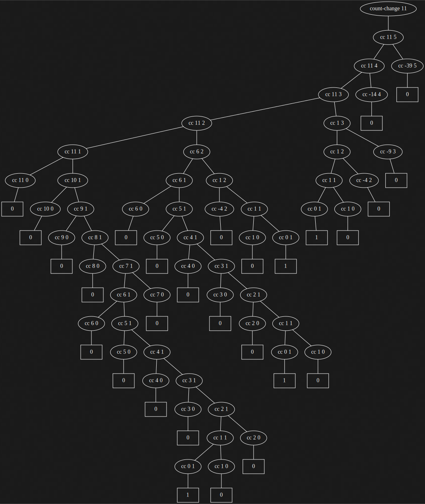

*心智的活动，除了尽力产生各种简单的认识之外，主要表现在如下三个方面：1）将若干简单认识组合为一个复合认识，由此产生出各种复杂的认识。2）将两个认识放在一起对照，不管它们如何简单或者复杂，在这样做时并不将它们合而为一。由此得到有关它们的相互关系的认识。3）将有关认识与那些在实际中和它们同在的所有其他认识隔离开，这就是抽象，所有具有普遍性的认识都是这样得到的。*

<div style="text-align: right;">
John Locke, An Essay Concerning Human Understanding<br>
( 有关人类理解的随笔，1690 )
</div>

### 练习 1

下面是一系列表达式，对于每个表达式，解释器将输出什么结果？假定这一系列表达式是按照给出的顺序逐个求值的。

```scheme
10
(+ 5 3 4)
(- 9 1)
(/ 6 2)
(+ (* 2 4) (- 4 6))
(define a 3)
(define b (+ a 1))
(+ a b (* a b))
(= a b)
(if (and (> b a) (< b (* a b)))
    b
    a)
(cond ((= a 4) 6)
      ((= b 4) (+ 6 7 a))
      (else 25))
(+ 2 (if (> b a) b a))
(* (cond ((> a b) a)
         ((< a b) b)
         (else -1))
   (+ a 1))
```

```scheme
#lang sicp

10
(+ 5 3 4)
(- 9 1)
(/ 6 2)
(+ (* 2 4) (- 4 6))
(define a 3)
(define b (+ a 1))
(+ a b (* a b))
(= a b)
(if (and (> b a) (< b (* a b)))
    b
    a)
(cond ((= a 4) 6)
      ((= b 4) (+ 6 7 a))
      (else 25))
(+ 2 (if (> b a) b a))
(* (cond ((> a b) a)
         ((< a b) b)
         (else -1))
   (+ a 1))

;: 10
;: 12
;: 8
;: 3
;: 6
;: 19
;: #f
;: 4
;: 16
;: 6
;: 16
```

### 练习 2

请将下面表达式变换为前缀形式：

$$
\frac{5 + 4 + (2 - (3 - (6 + \frac{4}{5})))}{3(6 - 2)(2 - 7)}
$$

```scheme
#lang sicp

(/ (+ 5 4 (- 2 (- 3 (+ 6 (/ 4 5)))))
   (* 3 (- 6 2) (- 2 7)))

;: -37/150
```

### 练习 3

请定义一个过程，它以三个数为参数，返回其中较大的两个数之和。

```scheme
#lang sicp

(define (sum-of-max-two a b c)
  (if (> a b)
      (if (> b c)
          (+ a b)
          (+ a c))
      (if (> a c)
          (+ a b)
          (+ b c))))

;>>> (sum-of-max-two 233 752 666)
;: 1418
```

### 练习 4

请仔细考察上面给出的允许运算符为复合表达式的组合式的求值模型，根据对这一模型的认识描述下面过程的行为：

```scheme
(define (a-plus-abs-b a b)
  ((if (> b 0) + -) a b))
```

完成计算： $a+\lvert b\rvert$ ，如果 $b\gt 0, a+b$ ；否则， $a-b$ 。

### 练习 5

Ben Bitdiddle 发明了一种检测方法，能够确定解释器究竟采用哪种序求值，是采用应用序，还是采用正则序。他定义了下面两个过程：

```scheme
(define (p) (p))
```

```scheme
(define (test x y)
  (if (= x 0)
      0
      y))
```

而后他求值下面的表达式：

```scheme
(test 0 (p))
```

如果某个解释器采用的是应用序求值，Ben 会看到什么样的情况？如果解释器采用正则序求值，他又会看到什么情况？请对你的回答做出解释。（无论采用正则序或者应用序，假定特殊形式 if 的求值规则总是一样的。其中的谓词部分先行求值，根据其结果确定随后求值的子表达式部分。）

采用的解释器为 DrRacket 的 SICP 插件环境，执行上述代码并没有任何输出，但 CPU 占用较高。因此测试环境采用的是应用序求值。

应用序求值时，会先获取每个子表达式的值，对于 `(test 0 (0))` 来说，第一个参数值为 `0` 已知，会去求第二个参数的值，而第二个参数会一直赋值，是求不出来的，程序陷入死循环。

正则序求值时，会直接将参数代入进行计算，计算 `(test 0 (p))`，此时第一个参数 `x` 为 `0`，直接返回结果 `0`。

### 练习 6

Alyssa P. Hacker 看不出为什么需要将 if 提供为一种特殊形式，她问：“为什么我不能直接通过 cond 将它定义为一个常规过程呢？” Alyssa 的朋友 Eva Lu Ator 断言确实可以这样做，并定义了 if 的一个新版本：

```scheme
(define (new-if predicate then-clause else-clause)
  (cond (predicate then-clause)
        (else else-clause)))
```

Eva 给 Alyssa 演示她的程序：

```scheme
(new-if (= 2 3) 0 5)
5
```

```scheme
(new-if (= 1 1) 0 5)
0
```

她很高兴地用自己的 new-if 重写了求平方根的程序：

```scheme
(define (sqrt-iter guess x)
  (new-if (good-enough? guess x)
      guess
      (sqrt-iter (improve guess x)
                 x)))
```

当 Alyssa 试着用这个过程去计算平方根时会发生什么事情呢？请给出解释。

```scheme
#lang sicp

(define (new-if predicate then-clause else-clause)
  (cond (predicate then-clause)
        (else else-clause)))

(define (sqrt-iter guess x)
  (new-if (good-enough? guess x)
      guess
      (sqrt-iter (improve guess x)
                 x)))

(define (improve guess x)
  (average guess (/ x guess)))

(define (average x y)
  (/ (+ x y) 2))

(define (good-enough? guess x)
  (< (abs (- (square guess) x)) 0.001))

(define (square x)
  (* x x))

(define (sqrt x)
  (sqrt-iter 1.0 x))

;>>> (sqrt 2)
;: Interactions disabled; out of memory
```

直接报错，内存超限。

由 [练习 5](#练习-5) 知，解释器采用应用序求值，因此定义的 `new-if` 过程会先获取所需的三个参数，而在 `sqrt-iter` 过程中，`new-if` 的 `else-clause` 为递归过程，因此解释器会尝试一直获取该参数的值，陷入死循环。

注：解释器提供的 if 过程为特殊过程，形式为 `(if <predicate> <consequent> <alternative>)`，会先获取 `<predicate>` 的值，如果为 `#t`，进入 `<consequent>`，否则进入 `<alternative>`。

### 练习 7

对于确定很小的数的平方根而言，在计算平方根中使用的检测 `good-enough?` 是很不好的。还有，在现实的计算机里，算术运算总是以一定有限精度进行的。这也会使我们的检测不适合非常大的数的计算。请解释以上论断，用例子说明对很小和很大的数，这种检测都可能失败。实现 `good-enough?` 的另一种策略是监测猜测值在从一次迭代到下一次的变化情况，当改变值相对于猜测值的比率很小时就结束。请设计一个采用这种终止测试方式的平方根过程。对于很大和很小的数，这一方式都能工作吗？

```scheme
#lang sicp

(define (sqrt-iter guess x)
  (if (good-enough? guess x)
      guess
      (sqrt-iter (improve guess x)
                 x)))

(define (improve guess x)
  (average guess (/ x guess)))

(define (average x y)
  (/ (+ x y) 2))

(define (good-enough? guess x)
  (< (abs (- (square guess) x)) 0.001))

(define (square x)
  (* x x))

(define (sqrt x)
  (sqrt-iter 1.0 x))

;>>> (sqrt 0.0001)
;: 0.03230844833048122

;>>> (sqrt 1e45)
;: 3.1622776601683792e+022

;>>> (sqrt 1e46)
;: 陷入死循环
```

对于 `(sqrt 0.0001)` 解释器计算结果为：`0.03230844833048122` ，计算误差太大，分析可知 `0.03230844833048122` 的平方 `0.0010438358335233748` 与 `0.0001` 的差 `0.0009438358335233748` 确实小于 `0.001` ，程序对此无能为力，归根结底是 `good-enough?` 的精度不够；解释器最大大概只能计算 `(sqrt 1e45)` ，对于 `(sqrt 1e46)` ，程序陷入死循环，但由于尾递归优化，并不会出现内存超限的情况，程序一直占用着 CPU 资源，原因也很好解释，如下：

$$
(\sqrt{x} + \Delta)^2-x=2\sqrt{x}\Delta+\Delta^2
$$

如果 $x$ 足够大， $2\sqrt{x}\Delta+\Delta^2$ 可以大于任意给定的精度，从而计算无法收敛。

基于以上的考虑，可以动态调整 $good-enough?$ 的精度。按照题目所给的实现方式，修改程序如下：

```scheme
#lang sicp

(define (sqrt-iter guess new x)
  (if (dynamic-good-enough? guess new)
      guess
      (sqrt-iter new
                 (improve new x)
                 x)))

(define (improve new x)
  (average new (/ x new)))

(define (average x y)
  (/ (+ x y) 2))

(define (dynamic-good-enough? old new)
  (< (abs (- 1 (/ new old))) 0.001))

(define (square x)
  (* x x))

(define (sqrt x)
  (sqrt-iter 1.0 (improve 1.0 x) x))

;>>> (sqrt 0.0001)
;: 0.010000714038711746

;>>> (sqrt 1e45)
;: 3.1627246890405767e+022

;>>> (sqrt 1e46)
;: 1.000011239171839e+023

;>>> (sqrt 1e100)
;: 1.000000633105179e+050
```

### 练习 8

求立方根的牛顿法基于如下事实，如果 $y$ 是 $x$ 的立方根的一个近似值，那么下式将给出一个更好的近似值：

$$
\frac{x/y^2+2y}{3}
$$

请利用这一公式实现一个类似平方根过程的求立方根的过程。

```scheme
#lang sicp

(define (cube-root-iter guess new x)
  (if (good-enough? guess new)
      guess
      (cube-root-iter new
                      (improve new x)
                      x)))

(define (good-enough? guess new)
  (< (abs (- 1 (/ new guess))) 0.00001))

(define (improve new x)
  (average (/ x new new) new new))

(define (average x y z)
  (/ (+ x y z) 3))

(define (cube-root x)
  (cube-root-iter 1.0 (improve 1.0 x) x))


;>>> (cube-root 0.001)
;: 0.10000000198565878

;>>> (cube-root 27)
;: 3.0000005410641766

;>>> (cube-root 1000)
;: 10.000000145265767

;>>> (cube-root 1e-99)
;: 1.0000000004754588e-033

;>>> (cube-root 1e300)
;: 1.000001286662801e+100
```

### 练习 9

下面几个过程各定义了一种加起两个正整数的方法，它们都基于过程 inc ( 它将参数加 1 ) 和 dec ( 它将参数减 1 ) 。

```scheme
(define (+ a b)
  (if (= a 0)
      b
      (inc (+ (dec a) b))))
```

```scheme
(define (+ a b)
  (if (= a 0)
      b
      (+ (dec a) (inc b))))
```

请用代换模型展示这两个过程在求值 `(+ 4 5)` 时所产生的计算过程。这些计算过程是递归的或者迭代的吗？

```scheme
(+ 4 5)
(inc (+ 3 5))
(inc (inc (+ 2 5)))
(inc (inc (inc (+ 1 5))))
(inc (inc (inc (inc (+ 0 5)))))
(inc (inc (inc (inc 5))))
(inc (inc (inc 6)))
(inc (inc 7))
(inc 8)
9
```

```scheme
(+ 4 5)
(+ 3 6)
(+ 2 7)
(+ 1 8)
(+ 0 9)
9
```

第一个过程是递归的，第二个过程是迭代的。

### 练习 10

下面过程计算一个称为 Ackermann 函数的数学函数：

```scheme
(define (A x y)
  (cond ((= y 0) 0)
        ((= x 0) (* 2 y))
        ((= y 1) 2)
        (else (A (- x 1)
                 (A x (- y 1))))))
```

下面各表达式的值是什么：

```scheme
(A 1 10)

(A 2 4)

(A 3 3)
```

请考虑下面的过程，其中的 A 就是上面定义的过程：

```scheme
(define (f n) (A 0 n))

(define (g n) (A 1 n))

(define (h n) (A 2 n))

(define (k n) (* 5 n n))
```

请给出过程 `f`、`g` 和 `h` 对给定整数值 $n$ 所计算的函数的数学定义。例如，`(k n)` 计算的是 $5n^2$。

```scheme
#lang sicp

(define (A x y)
  (cond ((= y 0) 0)
        ((= x 0) (* 2 y))
        ((= y 1) 2)
        (else (A (- x 1)
                 (A x (- y 1))))))

;>>> (A 1 10)
;: 1024

;>>> (A 2 4)
;: 65536

;>>> (A 3 3)
;: 65536
```

```scheme
(f n)
(A 0 n)
2n
```

$$
f(n) = 2n
$$

```scheme
(g n)
(A 1 n)
(A 0 (A 1 (- n 1)))
(f (g (- n 1)))
```

$$
g(n) = f(g(n-1)) = 2g(n-1) = \ldots = 2^{n-1}g(1) = 2^n
$$

```scheme
(h n)
(A 2 n)
(A 1 (A 2 (- n 1)))
(g (h (- n 1)))
```

$$
h(n)=g(h(n-1))=2^{h(n-1)}=...=2^{2^{\cdot^{\cdot^{\cdot^{2^{h(1)}}}}}}=2^{2^{\cdot^{\cdot^{\cdot^{2^{2}}}}}} (n \text{个} 2)
$$


以上过程未考虑 $n=0$ 的情况。


### 练习 11

函数 $f$ 由如下的规则定义：如果 $n<3$，那么 $f(n)=n$；如果 $n\ge 3$，那么 $f(n)=f(n-1)+2f(n-2)+3f(n-3)$。请写一个采用递归计算过程计算 $f$ 的过程。再写一个采用迭代计算过程计算 $f$ 的过程。

```scheme
#lang sicp

(define (f1 n)
  (if (< n 3) n
      (+ (f1 (- n 1))
         (* 2 (f1 (- n 2)))
         (* 3 (f1 (- n 3))))))

;: 假定 n >= 0
(define (f2 n)
  (define (f2-iter a b c n)
    (if (= n 2) c
        (f2-iter b
                 c
                 (+ c (* 2 b) (* 3 a))
                 (- n 1))))
  (if (< n 3) n
      (f2-iter 0 1 2 n)))

;>>> (f1 30)
;: 61354575194

;>>> (f2 30)
;: 61354575194
```

### 练习 12

下面数值模式称为帕斯卡三角形：

```scheme
    1
   1 1
  1 2 1
 1 3 3 1
1 4 6 4 1
   ...
```

三角形边界上的数都是 1，内部的每个数是位于它上面的两个数之和。请写一个过程，它采用递归计算过程计算出帕斯卡三角形。

```scheme
#lang sicp

(define (pascal-triangle row col)
  (cond ((< row col) -1)
        ((or (= col 1) (= col row)) 1)
        (else (+ (pascal-triangle (- row 1) (- col 1))
                 (pascal-triangle (- row 1) col)))))

;>>> (pascal-triangle 4 2)
;: 3

;>>> (pascal-triangle 6 4)
;: 10
```

### 练习 13

证明 $\text{Fib}(n)$ 是最接近 $\phi^n/\sqrt 5$ 的整数，其中 $\phi=(1+\sqrt 5)/2$。提示：利用归纳法和斐波那契数的定义（见 1.2.2 节），证明 $\text{Fib}(n)=(\phi^n-\gamma^n)/\sqrt 5$。

$$
\begin{cases}
  \text{Fib}(0) = 0 \\\\
  \text{Fib}(1) = 1 \\\\
  \text{Fib}(n) = \text{Fib}(n-1) + \text{Fib}(n-2), n\ge 2
\end{cases}
$$

当 $n\ge 2$ 时，

$$
\begin{bmatrix}
  \text{Fib}(n) \\\\
  \text{Fib}(n-1)
\end{bmatrix} =
\begin{bmatrix}
  1 & 1 \\\\
  1 & 0
\end{bmatrix}
\begin{bmatrix}
  \text{Fib}(n-1) \\\\
  \text{Fib}(n-2)
\end{bmatrix}
$$

记

$$
\bm{A} =
\begin{bmatrix}
  1 & 1 \\\\
  1 & 0
\end{bmatrix}
$$

将 $\bm{A}$ 对角化如下：

$$
\bm{A} =
\begin{bmatrix}
  1 & 1 \\\\
  1 & 0
\end{bmatrix} =
\frac{1}{\sqrt{5}}
\begin{bmatrix}
  \phi & \gamma \\\\
  1 & 1
\end{bmatrix}
\begin{bmatrix}
  \phi & 0 \\\\
  0 & \gamma
\end{bmatrix}
\begin{bmatrix}
  1 & -\gamma \\\\
  -1 & \phi
\end{bmatrix}
$$

其中，$\phi=\frac{1+\sqrt 5}{2}, \gamma=\frac{1-\sqrt 5}{2}$ 为 $\bm{A}$ 的特征值。因此：

$$
\begin{aligned}
  \begin{bmatrix}
    \text{Fib}(n) \\\\
    \text{Fib}(n-1)
  \end{bmatrix}
  &= \bm{A}^{n-1}
  \begin{bmatrix}
    \text{Fib}(1) \\\\
    \text{Fib}(0)
  \end{bmatrix} \\\\
  &= \frac{1}{\sqrt 5}
  \begin{bmatrix}
    \phi & \gamma \\\\
    1 & 1
  \end{bmatrix}
  \begin{bmatrix}
    \phi^{n-1} & 0 \\\\
    0 & \gamma^{n-1}
  \end{bmatrix}
  \begin{bmatrix}
    1 & -\gamma \\\\
    -1 & \phi
  \end{bmatrix}
  \begin{bmatrix}
    \text{Fib}(1) \\\\
    \text{Fib}(0)
  \end{bmatrix} \\\\
  &= \frac{1}{\sqrt 5}
  \begin{bmatrix}
    \phi^n - \gamma^n & \phi^{n-1} - \gamma^{n-1} \\\\
    \phi^{n-1} - \gamma^{n-1} & \phi^{n-2} - \gamma^{n-2}
  \end{bmatrix}
  \begin{bmatrix}
    1 \\\\
    0
  \end{bmatrix}
\end{aligned}
$$

$\Rightarrow \text{Fib}(n) = \left(\phi^n-\gamma^n\right)/{\sqrt 5} \quad (n\ge 0)$。

要证明 $\text{Fib}(n)$ 为最接近 $\phi^n/\sqrt 5$ 的整数，只需证明 $\lvert\text{Fib}(n) - \phi^n/\sqrt 5\rvert < 0.5$ 即可。

$\max{\lvert\gamma^n / \sqrt 5\rvert}=\gamma^0/\sqrt 5 \approx 1/2.236 < 0.5$，得证。

### 练习 14

请画出有关的树，展示 1.2.2 节的过程 `count-change` 在将 11 美分换成硬币时所产生的计算过程。相对于被换现金量的增加，这一计算过程的空间和步数增长的阶各是什么？



时间复杂度为叶节点的个数 $T(n)=\Theta(2^n)$，空间复杂度为树的深度 $S(n)=\Theta(n)$。

### 练习 15

在角（用弧度描述）$x$ 足够小时，其正弦值可以用 $\sin x\approx x$ 计算，而三角恒等式：

$$
\sin x =3\sin \frac{x}{3}-4\sin^3\frac{x}{3}
$$

可以减小 $\sin$ 的参数的大小（为完成这一练习，我们认为一个角是“足够小”，如果其数值不大于 0.1 弧度）。这些想法都体现在下述过程中：

```scheme
(define (cube x) (* x x x))

(define (p x) (- (* 3 x) (* 4 (cube x))))

(define (sine angle)
  (if (not (> (abs angle) 0.1))
      angle
      (p (sine (/ angle 3.0)))))
```

a) 在求值 `(sine 12.15)` 时，`p` 将被使用多少次？

b) 在求值 `(sine a)` 时，由过程 `sine` 所产生的计算过程使用的空间和步数（作为 $a$ 的函数）增长的阶是什么？

```scheme
(sine 12.15)
(p (sine 4.05))
(p (p (sine 1.35)))
(p (p (p (sine 0.45))))
(p (p (p (p (sine 0.15)))))
(p (p (p (p (p (sine 0.05))))))
```

即 `p` 将被使用 5 次。

时间复杂度和空间复杂度均为 $\Theta(\log a)$ 。

### 练习 16

请定义一个过程，它能产生出一个按照迭代方法的求幂计算过程，其中使用一系列的求平方，就像 fast-expt 一样只用对数个步骤。（提示：请利用关系 $(b^{n/2})^2=(b^2)^{n/2}$，除了指数 $n$ 和基数 $b$ 之外，还应维持一个附加的状态变量 $a$，并定义好状态变换，使得从一个状态转到另一个状态时乘积 $ab^n$ 不变。在计算过程开始时令 $a$ 取值 $1$，并用计算过程结束时 $a$ 的值作为回答，定义一个不变量，要求它在状态之间保持不变，这一技术是思考迭代算法设计问题时的一种非常强有力的方法。）

```scheme
#lang sicp

(define (fast-expt b n)
  (define (even? n)
    (= (remainder n 2) 0))
  (define (fast-expt-iter b n a)
    (cond ((= n 0) a)
          ((even? n) (fast-expt-iter (* b b) (/ n 2) a))
          (else (fast-expt-iter b (- n 1) (* a b)))))
  (fast-expt-iter b n 1))

;>>> (fast-expt 2 100)
;: 1267650600228229401496703205376

;>>> (fast-expt 233 666)
;: 45608249449321071866100423887710037382242303540141549438182496242630967356498403300585939221370743856986187265422069986290709044612487508462128088040902747685554711984886626823740068936201646465998047781291323652987572772058069995728882937506140140504257008579468379228550606745974431630982019632337016417060138268413281279845384946747504381921580241753023442634271482241060649036714318755753823145401892677099489710630922556129542048609567475559465982452063135308132933429890233808122027389285277264964924176508449211662347611168698873311900571051094076138040519803386754747307362834006882626700415214993070240801167355602795521863083515955510864179778671945897290584872919146476809837434854463437229210500470054228188263808948998447343504349599004630151477655748972818647675195704034143636332250506498413404529736819404059998733172045734960927853771586844272553696657099874870677594071599776653548857867859181671154866182945261398284712070353812203899610130674220038226641618463203348208551927496079463011686468216974042125906779958011178023232859028359641660595367491457705820841014430522977930845735516248984029837510541090983353875473984466834208054543087215059040900755509408687346015160580986408670546120176406650851308895847246735091833513849520187360246621896021646937864503090202916685215137385734423173203739580955346765580955409356257020956778600570894444370471939550328033688186114752380082028841287970670450765260208489908726223588727865855828074956323657564571040074575787604331082627110258301993255187030690233848909836296781038234056763169559208345629710722769
```

### 练习 17

本节里求幂算法的基础就是通过反复做乘法去求乘幂。与此类似，也可以通过反复做加法的方式求出乘积。下面的乘积过程与 `expt` 过程类似（其中假定我们的语言只有加法而没有乘法）：

```scheme
(define (* a b)
  (if (= b 0)
      0
      (+ a (* a (- b 1)))))
```

这一算法具有相对于 `b` 的线性步数。现在假定除了加法之外还有运算 `double`，它能求出一个整数的两倍；还有 `halve`，它将一个（偶）数除以 2。请用这些运算设计一个类似 `fast-expt` 的求乘积过程，使之只用对数的计算步数。

```scheme
#lang sicp

(define (fast-mult-rec a b)
  (cond ((= b 0) 0)
        ((even? b) (fast-mult-rec (double a) (halve b)))
        (else (+ a (fast-mult-rec a (- b 1))))))

(define (fast-mult-iter a b)
  (define (fast-mult-iter-core a b p)
    (cond ((= b 0) p)
          ((even? b) (fast-mult-iter-core (double a) (halve b) p))
          (else (fast-mult-iter-core a (- b 1) (+ p a)))))
  (fast-mult-iter-core a b 0))

(define (even? n) (= (remainder n 2) 0))

(define (double n) (+ n n))

(define (halve n) (/ n 2))

;>>> (fast-mult-rec 233 666)
;: 155178

;>>> (fast-mult-iter 233 666)
;: 155178
```

### 练习 18

利用 [练习 16](#练习-16) 和 [练习 17](#练习-17) 的结果设计一个过程，它能产生出一个基于加、加倍和折半运算的迭代计算过程，只用对数的步数就能求出两个整数的乘积。

（见 [练习 17](#练习-17) 代码 `fast-mult-iter` ）

### 练习 19

存在着一种以对数步数求出斐波那契数的巧妙算法。请回忆 1.2.2 节 `fib-iter` 计算过程中状态量 $a$ 和 $b$ 的变换规则，$a\leftarrow a+b$ 和 $b\leftarrow a$，现在将这种变换称为 $T$ 变换。通过观察可以发现，从 $1$ 和 $0$ 开始将 $T$ 反复应用 $n$ 次，将产生出一对数 $\text{Fib}(n+1)$ 和 $\text{Fib}(n)$。换句话说，斐波那契数可以通过将 $T^n$（变换 $T$ 的 $n$ 次方）应用于对偶 $(1, 0)$ 而产生出来。现在将 $T$ 看做是变换族 $T_{pq}$ 中 $p=0$ 且 $q=1$ 的特殊情况，其中 $T_{pq}$ 是对于对偶 $(a, b)$ 按照 $a\leftarrow bq+aq+ap$ 和 $b\leftarrow bp+aq$ 规则的变换。请证明，如果我们应用变换 $T_{pq}$ 两次，其效果等同于应用同样形式的一次变换 $T_{p'q'}$，其中的 $p'$ 和 $q'$ 可以由 $p$ 和 $q$ 计算出来。这就指明了一条求出这种变换的平方的路径，使我们可以通过连续求平方的方式去计算 $T^n$，就像 `fast-expt` 过程里所做的那样。将所有这些集中到一起，就形成了下面的过程，其运行只需要对数的步数：

```scheme
(define (fib n)
  (fib-iter 1 0 0 1 n))
(define (fib-iter a b p q count)
  (cond ((= count 0) b)
        ((even? count)
         (fib-iter a
                   b
                   <??>    ; compute p'
                   <??>    ; compute q'
                   (/ count 2)))
        (else (fib-iter (+ (* b q) (* a q) (* a p))
                        (+ (* b p) (* a q))
                        p
                        q
                        (- count 1)))))
```

```scheme
#lang sicp

(define (fib n)
  (fib-iter 1 0 0 1 n))
(define (fib-iter a b p q count)
  (cond ((= count 0) b)
        ((even? count)
         (fib-iter a
                   b
                   (+ (* p p) (* q q))
                   (+ ( * 2 p q) (* q q))
                   (/ count 2)))
        (else (fib-iter (+ (* b q) (* a q) (* a p))
                        (+ (* b p) (* a q))
                        p
                        q
                        (- count 1)))))

;>>> (fib 100)
;: 354224848179261915075
```

### 练习 20

一个过程所产生的计算过程当然依赖于解释器所使用的规则。作为一个例子，考虑上面给出的迭代式 `gcd` 过程，假定解释器用第 1.1.5 节讨论的正则序去解释这一过程（对 `if` 的正则序求值规则在练习 1.5 中描述）。请采用（正则序的）代换方法，展示在求值表达式 `(gcd 206 40)` 中产生的计算过程，并指明实际执行的 `remainder` 运算。在采用正则序求值 `(gcd 206 40)` 中实际执行了多少次 `remainder` 运算？如果采用应用序求值呢？

正则序：

```scheme
(gcd 206 40)
(gcd 40 (remainder 206 40))
(= (remainder 206 40) 0)
(gcd (remainder 206 40) (remainder 40 (remainder 206 40)))
(= (remainder 40 (remainder 206 40)) 0)
(gcd (remainder 40 (remainder 206 40)) (remainder (remainder 206 40) (remainder 40 (remainder 206 40))))
(= (remainder (remainder 206 40) (remainder 40 (remainder 206 40))) 0)
(gcd (remainder (remainder 206 40) (remainder 40 (remainder 206 40))) (remainder (remainder 40 (remainder 206 40)) (remainder (remainder 206 40) (remainder 40 (remainder 206 40)))))
(= (remainder (remainder 40 (remainder 206 40)) (remainder (remainder 206 40) (remainder 40 (remainder 206 40)))) 0)
(remainder (remainder 206 40) (remainder 40 (remainder 206 40)))
(remainder 6 (remainder 40 6))
(remainder 6 4)
2
```

实际执行了 18 次 `remainder` 过程。

应用序：

```scheme
(gcd 206 40)
(gcd 40 (remainder 206 40))
(gcd 40 6)
(gcd 6 (remainder 40 6))
(gcd 6 4)
(gcd 4 (remainder 6 4))
(gcd 4 2)
(gcd 2 (remainder 4 2))
(gcd 2 0)
2
```

实际执行了 4 次 `remainder` 过程。

### 练习 21

使用 `smallest-divisor` 过程找出下面各数的最小因子：199、1999、19999。

```scheme
#lang sicp

(define (smallest-divisor n)
  (find-divisor n 2))

(define (find-divisor n test-divisor)
  (cond ((> (square test-divisor) n) n)
        ((divides? test-divisor n) test-divisor)
        (else (find-divisor n (+ test-divisor 1)))))

(define (square x) (* x x))

(define (divides? a b)
  (= (remainder b a) 0))

;>>> (smallest-divisor 199)
;: 199

;>>> (smallest-divisor 1999)
;: 1999

;>>> (smallest-divisor 19999)
;: 7
```

### 练习 22

大部分 Lisp 实现都包含一个 `runtime` 基本过程，调用它将返回一个整数，表示系统已经运行的时间（例如，以微妙计）。在对整数 $n$ 调用下面的 `timed-prime-test` 过程时，将打印出 $n$ 并检查 $n$ 是否为素数。如果 $n$ 是素数，过程将打印出三个星号，随后是执行这一检查所用的时间量。

```scheme
(define (timed-prime-test n)
  (newline)
  (display n)
  (start-prime-test n (runtime)))

(define (start-prime-test n start-time)
  (if (prime? n)
      (report-prime (- (runtime) start-time))))

(define (report-prime elapsed-time)
  (display " *** ")
  (display elapsed-time))
```

请利用这一过程写一个 `search-for-primes` 过程，它检查给定范围内连续的各个奇数的素性。请用你的过程找出大于 1000、大于 10000、大于 100000 和大于 1000000 的三个最小的素数。请注意其中检查每个素数所需要的时间。因为这一检查算法具有 $\Theta(\sqrt n)$ 的增长阶，你可以期望在 10000 附近的素数检查的耗时大约是在 1000 附近的素数检查的 $\sqrt{10}$ 倍。你得到的数据确实如此吗？对于 100000 和 1000000 得到的数据，对这一 $\sqrt n$ 预测的支持情况如何？有人说程序在你的机器上运行的时间正比于计算所需的步数，你得到的结果符合这种说法吗？

```scheme
#lang sicp

(define (prime? n)
  (define (smallest-divisor n)
    (find-divisor n 2))
  (define (find-divisor n test-divisor)
    (cond ((> (square test-divisor) n) n)
          ((divides? test-divisor n) test-divisor)
          (else (find-divisor n (+ test-divisor 1)))))
  (define (square x) (* x x))
  (define (divides? a b)
    (= (remainder b a) 0))
  (= (smallest-divisor n) n))

(define (timed-prime-test n)
  (newline)
  (display n)
  (start-prime-test n (runtime)))

(define (start-prime-test n start-time)
  (if (prime? n)
      (report-prime (- (runtime) start-time))))

(define (report-prime elapsed-time)
  (display " *** ")
  (display elapsed-time))

(define (search-for-primes start end)
  (cond ((< start end)
         (timed-prime-test start)
         (search-for-primes (+ start 2) end))))

(search-for-primes 1001 1030)
(newline)
(search-for-primes 10001 10040)
(newline)
(search-for-primes 100001 100050)
(newline)
(search-for-primes 1000000001 1000000100)
(newline)
(search-for-primes 100000000001 100000000100)

;: 只列出了素数部分

;: 1009 *** 0
;: 1013 *** 0
;: 1019 *** 0
;: 1021 *** 0

;: 10007 *** 0
;: 10009 *** 0
;: 10037 *** 0
;: 10039 *** 0

;: 100003 *** 0
;: 100019 *** 0
;: 100043 *** 0
;: 100049 *** 0

;: 1000000007 *** 3988
;: 1000000009 *** 2011
;: 1000000021 *** 1993
;: 1000000033 *** 1995
;: 1000000087 *** 1996
;: 1000000093 *** 1993
;: 1000000097 *** 1995

;: 100000000003 *** 19947
;: 100000000019 *** 21941
;: 100000000057 *** 19944
;: 100000000063 *** 19946
;: 100000000069 *** 20945
;: 100000000073 *** 19948
;: 100000000091 *** 19945
```

从以上结果可知，在数字较小时，运行时间都为 0，无法做出判断。而在数字较大时，将数字增大 100 倍，运行时间几乎为 10 $(\sqrt{100})$ 倍，基本符合题目的说法。

### 练习 23

在本节开始时给出的那个 `smallest-divisor` 过程做了许多无用检查：在它检查了一个数是否能被 2 整除之后，实际上已经完全没必要再检查它是否能被任何偶数整除了。这说明 `test-divisor` 所用的值不应该是 2，3，4，5，6，...，而应该是 2，3，5，7，9，...。请实现这种修改。其中定义一个过程 `next`，用 2 调用时返回 3，否则就返回其输入值加 2。修改 `smallest-divisor` 过程，使它去使用 `(next test-divisor)` 而不是 `(+ test-divisor 1)`。让 `timed-prime-test` 结合这个 `smallest-divisor` 版本，运行**练习 1.22** 里的 12 个找素数测试。因为这一修改使检查的步数减少一半，你可能期望它的运行速度快一倍。实际情况符合这一预期吗？如果不符合，你所观察到的两个算法速度的比值是什么？你如何解释这一比值不是 2 的事实？

```scheme
#lang sicp

(define (prime? n)
  (define (smallest-divisor n)
    (find-divisor n 2))
  (define (find-divisor n test-divisor)
    (cond ((> (square test-divisor) n) n)
          ((divides? test-divisor n) test-divisor)
          (else (find-divisor n (next test-divisor)))))
  (define (square x) (* x x))
  (define (divides? a b)
    (= (remainder b a) 0))
  (define (next n)
    (if (= n 2) 3 (+ n 2)))
  (= (smallest-divisor n) n))

(define (timed-prime-test n)
  (newline)
  (display n)
  (start-prime-test n (runtime)))

(define (start-prime-test n start-time)
  (if (prime? n)
      (report-prime (- (runtime) start-time))))

(define (report-prime elapsed-time)
  (display " *** ")
  (display elapsed-time))

(define (search-for-primes start end)
  (cond ((< start end)
         (timed-prime-test start)
         (search-for-primes (+ start 2) end))))

(search-for-primes 1001 1030)
(newline)
(search-for-primes 10001 10040)
(newline)
(search-for-primes 100001 100050)
(newline)
(search-for-primes 1000000001 1000000100)
(newline)
(search-for-primes 100000000001 100000000100)

;: 只列出了素数部分

;: 1009 *** 0
;: 1013 *** 0
;: 1019 *** 0
;: 1021 *** 0

;: 10007 *** 0
;: 10009 *** 0
;: 10037 *** 0
;: 10039 *** 0

;: 100003 *** 0
;: 100019 *** 0
;: 100043 *** 0
;: 100049 *** 0

;: 1000000007 *** 996
;: 1000000009 *** 997
;: 1000000021 *** 997
;: 1000000033 *** 1993
;: 1000000087 *** 1996
;: 1000000093 *** 998
;: 1000000097 *** 997

;: 100000000003 *** 12965
;: 100000000019 *** 12969
;: 100000000057 *** 11968
;: 100000000063 *** 11968
;: 100000000069 *** 12964
;: 100000000073 *** 12966
;: 100000000091 *** 12005
```

对比 [练习 23](#练习-23)，[练习 22](#练习-22) 的结果，改进后的算法运行时间确实几乎为之前的一半。

### 练习 24

修改 [练习 22](#练习-22) 的 `timed-prime-test` 过程，让它使用 `fast-prime?`（费马方法），并检查你在练习中找出的 12 个素数。因为费马检查具有 $\Theta(\log n)$ 的增长速度，对接近 1000000 的素数检查与接近 1000 的素数检查作对期望时间之间的比较有怎样的预期？你的数据确实表明这一预期吗？你能解释所发现的任何不符合预期的地方吗？

```scheme
#lang sicp

(define (fast-prime? n times)
  (cond ((= times 0) true)
        ((fermat-test n) (fast-prime? n (- times 1)))
        (else false)))

(define (fermat-test n)
  (define (try-it a)
    (= (expmod a n n) a))
  (try-it (+ 1 (random (- n 1)))))

(define (expmod base exp m)
  (cond ((= exp 0) 1)
        ((even? exp)
         (remainder (square (expmod base (/ exp 2) m))
                    m))
        (else
         (remainder (* base (expmod base (- exp 1) m))
                    m))))

(define (square x) (* x x))

(define (timed-prime-test n)
  (newline)
  (display n)
  (start-prime-test n (runtime)))

(define (start-prime-test n start-time)
  (if (fast-prime? n 10)
      (report-prime (- (runtime) start-time))))

(define (report-prime elapsed-time)
  (display " *** ")
  (display elapsed-time))

(define (search-for-primes start end)
  (cond ((< start end)
         (timed-prime-test start)
         (search-for-primes (+ start 2) end))))

(search-for-primes 1001 1030)
(newline)
(search-for-primes 10001 10040)
(newline)
(search-for-primes 100001 100050)
(newline)
(search-for-primes 1000000001 1000000100)
; 这一组超出了 random 范围
; (newline)
; (search-for-primes 100000000001 100000000100)

;: 只列出了素数部分

;: 1009 *** 0
;: 1013 *** 0
;: 1019 *** 0
;: 1021 *** 0

;: 10007 *** 0
;: 10009 *** 0
;: 10037 *** 0
;: 10039 *** 0

;: 100003 *** 0
;: 100019 *** 0
;: 100043 *** 0
;: 100049 *** 0

;: 1000000007 *** 0
;: 1000000009 *** 0
;: 1000000021 *** 0
;: 1000000033 *** 0
;: 1000000087 *** 0
;: 1000000093 *** 0
;: 1000000097 *** 0
```

运行时间都为 0，无法比较，但也确实说明了 `fast-prime?` 运行时间更短（对于较大的数据）。

### 练习 25

Alyssa P. Hacker 提出，在写 `expmod` 时我们做了过多的额外工作。她说，毕竟我们已经知道怎样计算乘幂，因此只需要简单地写：

```scheme
(define (expmod base exp m)
  (remainder (fast-expt base exp) m))
```

她说的对吗？这一过程能很好地用于我们的快速素数检查程序吗？请解释这些问题。

这一过程能正常工作，但是效率太低，因为在求模过程中，完全没必要把非常大的幂次算出来，而这一过程却会计算非常高的幂次，还会对其求余，导致比较大的计算开销。

### 练习 26

Louis Reasoner 在做 [练习 24](#练习-24) 时遇到了很大困难，它的 `fast-prime?` 检查看起来运行得比他的 `prime?` 检查还慢。Louis 请他的朋友 Eva Lu Ator 过来帮忙。在检查 Louis 的代码时，两个人发现他重写了 `expmod` 过程，其中用了一个显式的乘法，而没有调用 `square`：

```scheme
(define (expmod base exp m)
  (cond ((= exp 0) 1)
        ((even? exp)
         (remainder (* (expmod base (/ exp 2) m)
                       (expmod base (/ exp 2) m))
                    m))
        (else
         (remainder (* base (expmod base (- exp 1) m))
                    m))))
```

“我看不出来这会造成什么不同，” Louis 说。“我能看出，” Eva 说，“采用这种方式写出该过程时，你就把一个 $\Theta(\log n)$ 的计算过程变成 $\Theta(n)$ 的了。” 请解释这一问题。

如果采用以上过程，当 `exp` 为偶数时，会执行两遍 `(expmod base (/ exp 2) m)` 过程，达不到“折半”的效果，而 $\Theta(\log n)$ 复杂度正是由于每次使计算量“折半”得到的，上述过程将“折半”的效果“抵消”了，变成了原本的线性复杂度。

### 练习 27

证明脚注 47 中列出的 Carmichael 数确实能骗过费马检查。也就是说，写一个过程，它以整数 $n$ 为参数，对每个 $a\lt n$ 检查 $a^n$ 是否与 $a$ 模 $n$ 同余。用你的过程去检查前面给出的那些 Carmichael 数。

```scheme
#lang sicp

(define (prime? n)
  (define (smallest-divisor n)
    (find-divisor n 2))
  (define (find-divisor n test-divisor)
    (cond ((> (square test-divisor) n) n)
          ((divides? test-divisor n) test-divisor)
          (else (find-divisor n (+ test-divisor 1)))))
  (define (square x) (* x x))
  (define (divides? a b)
    (= (remainder b a) 0))
  (= (smallest-divisor n) n))

(define (expmod base exp m)
  (define (square x) (* x x))
  (cond ((= exp 0) 1)
        ((even? exp)
         (remainder (square (expmod base (/ exp 2) m))
                    m))
        (else
         (remainder (* base (expmod base (- exp 1) m))
                    m))))

(define (carmichael-test n)
  (if (prime? n) false
      (fake-fermat-test n 2)))

(define (fake-fermat-test n test)
  (cond ((= test n) true)
        ((= (expmod test n n) test)
         (fake-fermat-test n (+ test 1)))
        (else false)))

; carmichael numbers:
; 561 1105 1729 2465 2821 6601 ...
(carmichael-test 561)
(carmichael-test 1105)
(carmichael-test 1729)
(carmichael-test 2465)
(carmichael-test 2821)
(carmichael-test 6601)
(newline)
(carmichael-test 2333)
(carmichael-test 752)

;: #t
;: #t
;: #t
;: #t
;: #t
;: #t

;: #f
;: #f
```

### 练习 28

费马检查的一种不会被欺骗的变形成为 Miller-Rabin 检查（Miller 1976；Rabin 1980），它来源于费马小定理的一个变形。这一变形断言，如果 $n$ 是素数，$a$ 是任何小于 $n$ 的整数，则 $a$ 的 $(n-1)$ 次幂与 $1$ 模 $n$ 同余。要用 Miller-Rabin 检查考察 $n$ 的素性，我们应随机地取一个数 $a\lt n$ 并用过程 `expmod` 求 $a$ 的 $(n-1)$ 次幂对 $n$ 的模。然而，在执行 `expmod` 中的平方步骤时，我们需要查看是否遇到了“$1$ 取模 $n$ 的非平凡平方根”，也就是说，是不是存在不等于 $1$ 或者 $n-1$ 的数，其平方取模 $n$ 等于 $1$ 。可以证明，如果 $1$ 的这种非平凡平方根存在，那么 $n$ 就不是素数。还可以证明，如果 $n$ 是非素数的奇数，那么，至少有一半的数 $a\lt n$ ，按照这种方式计算 $a^{n-1}$ ，将会遇到 $1$ 取模 $n$ 的非平凡平方根。这也是 Miller-Rabin 检查不会受骗的原因。请修改 `expmod` 过程，让它在发现 $1$ 的非平凡平方根时报告失败，并利用它实现一个类似于 `fermat-test` 的过程，完成 Miller-Rabin 检查。通过检查一些已知素数和非素数的方式考验你的过程。提示：送出失败信号的一种简单方式就是让它返回 0。

```scheme
#lang sicp

(define (remainder-square-checked x m)
  (if (and (not (or (= x 1)
                    (= x (- m 1))))
           (= (remainder (* x x) m) 1))
      0
      (remainder (* x x) m)))

(define (expmod-checked base exp m)
  (cond ((= exp 0) 1)
        ((even? exp)
         (remainder-square-checked (expmod-checked base (/ exp 2) m) m))
        (else
         (remainder (* base (expmod-checked base (- exp 1) m))
                    m))))

(define (miller-rabin-test n)
  (define (try-it a)
    (= (expmod-checked a (- n 1) n) 1))
  (try-it (+ 1 (random (- n 1)))))


(define (miller-rabin-prime?  n times)
  (cond ((= times 0) #t)
        ((miller-rabin-test n)
         (miller-rabin-prime? n (- times 1)))
        (else #f)))

(define (assert-result test-name actual expected)
  (display (if (eq? actual expected) "pass: " "fail: "))
  (display test-name)
  (newline))

(assert-result "   2 is prime"      (miller-rabin-prime?    2 10) #t)
(assert-result "1009 is prime"      (miller-rabin-prime? 1009 10) #t)
(assert-result "   4 is not prime"  (miller-rabin-prime?    4 10) #f)
(assert-result "  99 is not prime"  (miller-rabin-prime?   99 10) #f)
(assert-result " 561 is not prime " (miller-rabin-prime?  561 10) #f) ; (Carmichael number)

;: pass:    2 is prime
;: pass: 1009 is prime
;: pass:    4 is not prime
;: pass:   99 is not prime
;: pass:  561 is not prime
```

### 练习 29

辛普森规则是另一种比上面所用规则更精确的数值积分方法。采用辛普森规则，函数 $f$ 在范围 $a$ 和 $b$ 之间的定积分的近似值是：

$$
\frac{h}{3}\left[y_0+4y_1+2y_2+4y_3+2y_4+\cdots+2y_{n-2}+4y_{n-1}+y_n\right]
$$

其中 $h=(b-a)/n$ , $n$ 是某个偶数，而 $y_k=f(a+kh)$ （增大 $n$ 能提高近似值的精度）。请定义一个具有参数 $f$ 、$a$ 、$b$ 和 $n$ ，采用辛普森规则计算并返回积分值的过程。用你的函数求出 `cube` 在 $0$ 和 $1$ 之间的积分（用 $n=100$ 和 $n=1000$ ），并将得到的值与上面用 `integral` 过程所得到的结果比较。

```scheme
#lang sicp

(define (cube x) (* x x x))

(define (sum term a next b)
  (if (> a b)
      0
      (+ (term a)
         (sum term (next a) next b))))

(define (integral f a b dx)
  (define (add-dx x) (+ x dx))
  (* (sum f (+ a (/ dx 2.0)) add-dx b)
     dx))

(define (simpson-integral f a b n)  
  (let ((h (/ (- b a) n)))
    (define (next a) (+ a h h))
    (* (/ h 3)
       (+ (f a)
          (* 4 (sum f (+ a h) next b))
          (* 2 (sum f (+ a h h) next b))
          (f b)))))


(integral cube 0 1.0 0.01)
(simpson-integral cube 0 1.0 100)
(integral cube 0 1.0 0.001)
(simpson-integral cube 0 1.0 1000)

;: 0.24998750000000042
;: 0.25000000000000044
;: 0.249999875000001
;: 0.25000000000000083
```

采用辛普森规则的精度明显更高。

### 练习 30

上面的过程 `sum` 将产生出一个线性递归。我们可以重写该过程，使之能够迭代地执行。请说明应该怎样通过填充下面定义中缺少的表达式，完成这一工作。

```scheme
(define (sum term a next b)
  (define (iter a result)
    (if <??>
        <??>
        (iter <??> <??>)))
  (iter <??> <??>))
```

构建迭代过程，关键在于记录中间结果并完成状态转换，过程 `(iter a result)` 中的 `result` 即完成中间结果的记录，当迭代结束时，其记录值为最终结果；`a` 便是过程转换变量，将需要的项累加到 `result` 后，`a` 转换到下一个值，保证最终求和不变。具体代码如下：

```scheme
#lang sicp

(define (sum term a next b)
  (define (iter a result)
    (if (> a b)
        result
        (iter (next a)
              (+ result
                 (term a)))))
  (iter a 0))
```

### 练习 31

a）过程 `sum` 是可以用高阶过程表示的大量类似抽象中最简单的一个。请写出一个类似的成为 `product` 的过程，它返回在给定范围中各点的某个函数值的乘积。请说明如何用 `product` 定义 `factorial` 。另请按照下面公式计算 $\pi$ 的近似值：

$$
\frac{\pi}{4}=\frac{2\cdot4\cdot4\cdot6\cdot6\cdot8\cdots}{3\cdot3\cdot5\cdot5\cdot7\cdot7\cdots}
$$

b）如果你的 `product` 过程生成的是一个递归计算过程，那么请写出一个生成迭代计算过程的过程。如果它生成一个迭代计算过程，请写出一个生成递归计算过程的过程。

```scheme
#lang sicp

(define (product term a next b)
  (if (> a b)
      1
      (* (term a)
         (product term (next a) next b))))

(define (factorial n)
  (define (next i) (+ i 1))
  (define (term x) x)
  (product term 1 next n))

(define (calc-pi n)
  (define (next i) (+ i 2))
  (define (term i)
    (/ (* (- i 1) (+ i 1)) i i))
  (* 4.0
     (product term 3 next n)))

(define (product-iter term a next b)
  (define (iter a result)
    (if (> a b)
        result
        (iter (next a)
              (* (term a) result))))
  (iter a 1))

(define (factorial-iter n)
  (define (next i) (+ i 1))
  (define (term x) x)
  (product-iter term 1 next n))

(define (calc-pi-iter n)
  (define (next i) (+ i 2))
  (define (term i)
    (/ (* (- i 1) (+ i 1)) i i))
  (* 4.0
     (product-iter term 3 next n)))

(factorial 10)
(calc-pi 100)
(calc-pi 10000)
(factorial-iter 10)
(calc-pi-iter 100)
(calc-pi-iter 10000)

;: 3628800
;: 3.157339689217565
;: 3.1417497371492673
;: 3628800
;: 3.157339689217565
;: 3.1417497371492673
```

### 练习 32

a）请说明，`sum` 和 `product`（**练习 1.31**）都是另一称为 `accumulate` 的更一般概念的特殊情况，`accumulate` 使用某些一般性的累积函数组合起一系列项：

```scheme
(accumulate combiner null-value term a next b)
```

`accumulate` 取的是与 `sum` 和 `product` 一样的项和范围描述参数，再加上一个（两个参数的）`combiner` 过程，它描述如何将当前项与前面各项的积累结果组合起来，另外还有一个 `null-value` 参数，它描述在所有的项都用完时的基本值。请写出 `accumulate` ，并说明我们能怎样基于简单地调用 `accumulate` ，定义出 `sum` 和 `product` 来。

b）如果你的 `accumulate` 过程生成的是一个递归计算过程，那么请写出一个生成迭代计算过程的过程。如果它生成一个迭代计算过程，请写出一个生成递归计算过程的过程。

如下述代码所示：`sum` 过程的 `combiner` 为 `+` ，`null-value` 为 `0`，`product` 过程的 `combiner` 为 `*` ，`null-value` 为 `1`。

```scheme
#lang sicp

(define (accumulate combiner null-value term a next b)
  (if (> a b)
      null-value
      (combiner (term a)
                (accumulate combiner null-value
                            term (next a) next b))))

(define (accumulate-iter combiner null-value term a next b)
  (define (iter a result)
    (if (> a b)
        result
        (iter (next a)
              (combiner (term a)
                        result))))
  (iter a null-value))

(define (sum term a next b)
  (accumulate + 0 term a next b))

(define (product term a next b)
  (accumulate-iter * 1 term a next b))

(define (term x) x)
(define (next n) (+ n 1))

(sum term 1 next 10)
(product term 1 next 10)

;: 55
;: 3628800
```

### 练习 33

你可以通过引进一个处理被组合项的过滤器（filter）概念，写出一个比 `accumulate`（练习 1.32）更一般的版本。也就是说，在计算过程中，只组合起由给定范围得到的项里的那些满足特定条件的项。这样得到的 `filtered-accumulate` 抽象取与上面累积过程同样的参数，再加上一个另外的描述有关过滤器的谓词参数。请写出 `filtered-accumulate` 作为一个过程，说明如何用 `filtered-accumulate` 表达以下内容：

a）求出在区间 $a$ 到 $b$ 中所有素数之和（假定你已经写出了谓词 `prime?` ）。

b）小于 $n$ 的所有与 $n$ 互素的正整数（即所有满足 $\text{GCD}(i, n)=1$ 的整数 $i\lt n$）之乘积。

```scheme
#lang sicp

(define (filtered-accumulate combiner null-value term a next b filter)
  (if (> a b) null-value
      (combiner (if (filter a) (term a)
                    null-value)
                (filtered-accumulate combiner null-value term
                                     (next a) next b filter))))

(define (prime? n)
  (define (square x) (* x x))
  (define (divides? a b)
    (= (remainder b a) 0))
  (define (find-divisor n test-divisor)
    (cond ((> (square test-divisor) n) n)
          ((divides? test-divisor n) test-divisor)
          (else (find-divisor n (+ test-divisor 1)))))
  (define (smallest-divisor n)
    (find-divisor n 2))
  (= n (smallest-divisor n)))

(define (coprime? n m)
  (define (gcd a b)
    (if (= b 0)
        a
        (gcd b (remainder a b))))
  (= (gcd n m) 1))

(define (sum-of-primes a b)
  (define (term x) x)
  (define (next x) (+ x 1))
  (filtered-accumulate + 0 term a next b prime?))

(define (product-of-coprimes n)
  (define (term x) x)
  (define (next x) (+ x 1))
  (define (filter a) (coprime? n a))
  (filtered-accumulate * 1 term 1 next n filter))

(sum-of-primes 2 10)
(product-of-coprimes 10)

;: 17
;: 189
```

### 练习 34

假定我们定义了：

```scheme
(define f g)
  (g 2))
```

而后就有：

```scheme
(f square)
4

(f (lambda (z) (* z (+ z 1))))
6
```

如果我们（坚持）要求解释器去求值 `(f f)` ，那会发生什么情况呢？请给出解释。

```scheme
#lang sicp

(define (f g)
  (g 2))

(f f)

;: 报错
;: application: not a procedure;
;: expected a procedure that can be applied to arguments
;:  given: 2
;:  arguments...:
;:   2
```

程序运行过程如下：

```scheme
(f f)
(f 2)
```

而 `f` 的定义中要求 `f` 的参数是一个过程，因此报错，期望一个过程作为参数，但提供的是数字 `2` 。

### 练习 35

请证明黄金分割率 $\phi$ （1.2.2 节）是变换 $x\mapsto 1+1/x$ 的不动点。请利用这一事实，通过过程 `fixed-point` 计算出 $\phi$ 的值。

```scheme
#lang sicp

(define tolerance 0.00001)

(define (fixed-point f first-guess)
  (define (close-enough? v1 v2)
    (< (abs (- v1 v2)) tolerance))
  (define (try guess)
    (let ((next (f guess)))
      (if (close-enough? guess next)
          next
          (try next))))
  (try first-guess))

(define golden-ratio
  (fixed-point (lambda (x) (+ 1 (/ 1 x)))
               1.0))

golden-ratio

;: 1.6180327868852458
```

### 练习 36

请修改 `fixed-point` ，使它能打印出计算中所产生的近似值序列，用 [练习 22](#练习-22) 展示的 `newline` 和 `display` 基本过程。而后通过找出 $x\mapsto \log(1000)/\log(x)$ 的不动点的方式，确定 $x^x=1000$ 的一个根（请利用 Scheme 的基本过程 `log` ，它计算自然对数值）。请比较一下采用平均阻尼和不用平均阻尼时的计算步数。（注意，你不能用猜测 `1` 去启动 `fixed-point` ，因为这将导致除以 $\log(1)=0$ 。）

```scheme
#lang sicp

(define tolerance 0.00001)

(define (fixed-point f first-guess)
  (define (close-enough? v1 v2)
    (< (abs (- v1 v2)) tolerance))
  (define (try guess)
    (display guess)
    (newline)
    (let ((next (f guess)))      
      (if (close-enough? guess next)
          next
          (try next))))
  (try first-guess))

(fixed-point (lambda (x) (/ (log 1000) (log x))) 2.0)

(newline)

(fixed-point (lambda (x) (/ (+ (/ (log 1000) (log x)) x) 2)) 2.0)

;: 2.0
;: 9.965784284662087
;: 3.004472209841214
;: 6.279195757507157
;: 3.759850702401539
;: 5.215843784925895
;: 4.182207192401397
;: 4.8277650983445906
;: 4.387593384662677
;: 4.671250085763899
;: 4.481403616895052
;: 4.6053657460929
;: 4.5230849678718865
;: 4.577114682047341
;: 4.541382480151454
;: 4.564903245230833
;: 4.549372679303342
;: 4.559606491913287
;: 4.552853875788271
;: 4.557305529748263
;: 4.554369064436181
;: 4.556305311532999
;: 4.555028263573554
;: 4.555870396702851
;: 4.555315001192079
;: 4.5556812635433275
;: 4.555439715736846
;: 4.555599009998291
;: 4.555493957531389
;: 4.555563237292884
;: 4.555517548417651
;: 4.555547679306398
;: 4.555527808516254
;: 4.555540912917957
;: 4.555532270803653

;: 2.0
;: 5.9828921423310435
;: 4.922168721308343
;: 4.628224318195455
;: 4.568346513136242
;: 4.5577305909237005
;: 4.555909809045131
;: 4.555599411610624
;: 4.5555465521473675
;: 4.555537551999825
```

### 练习 37

a）一个无穷连分式是一个如下形式的表达式：

$$
f=\frac{N_1}{D_1+\frac{N_2}{D_2+\frac{N_3}{D_3+\cdots}}}
$$

作为一个例子，我们可以证明在所有的 $N_i$ 和 $D_i$ 都等于 $1$ 时，这一无穷连分式产生出 $1/\phi$ ，其中的 $\phi$ 就是黄金分割率（见 1.2.2 节的描述）。逼近某个无穷连分式的一种方法是在给定数目的项之后截断，这样的一个截断称为 $k$ 项有限连分式，其形式是：

$$
\frac{N_1}{D_1+\frac{N_2}{\ddots+\frac{N_k}{D_k}}}
$$

假定 $n$ 和 $d$ 都是只有一个参数（项的下标 $i$ ）的过程，它们分别返回连分式的项 $N_i$ 和 $D_i$ 。请定义一个过程 `cont-frac` ，使得对 `(cont-frac n d k)` 的求值计算出 `k` 项有限连分式的值。通过如下调用检查你的过程对于顺序的 `k` 值是否逼近 $1/\phi$ ：

```scheme
(cont-frac (lambda (i) 1.0)
           (lambda (i) 1.0)
           k)
```

你需要取多大的 `k` 才能保证得到的近似值具有十进制的 4 为精度？

b）如果你的计算过程产生一个递归计算过程，那么请写出另一个产生迭代计算的过程。如果它产生迭代计算，请写出另一个过程，使之产生一个递归计算过程。

```scheme
#lang sicp

(define (cont-frac n d k)
  (define (rec i)
    (if (> i k)
        0
        (/ (n i)
           (+ (d i)
              (rec (+ i 1))))))
  (rec 1))

(define (cont-frac-iter n d k)
  (define (iter i res)
    (if (= i 0)
        res
        (iter (- i 1)
              (/ (n i)
                 (+ (d i)
                    res)))))
  (iter k 0))

;: exact value:
;: 0.6180339887498948

(cont-frac (lambda (i) 1.0)
           (lambda (i) 1.0)
           10)
(cont-frac-iter (lambda (i) 1.0)
                (lambda (i) 1.0)
                11)

;: 0.6179775280898876
;: 0.6180555555555556
```

### 练习 38

在 1737 年，瑞士数学家莱昂哈德 $\cdot$ 欧拉发表了一篇论文 De Fractionibus Continuis，文中包含了 $e-2$ 的一个连分式展开，其中的 $e$ 是自然对数的底。在这一分式中，$N_i$ 全都是 $1$ ，而 $D_i$ 依次为 $1, 2, 1, 1, 4, 1, 1, 6, 1, 1, 8, \cdots$ 。请写出一个程序，其中使用你在**练习 1.37** 中所做的 `cont-frac` 过程，并能基于欧拉的展开式求出 $e$ 的近似值。

```scheme
#lang sicp

(define (cont-frac n d k)
  (define (iter i res)
    (if (= i 0)
        res
        (iter (- i 1)
              (/ (n i)
                 (+ (d i)
                    res)))))
  (iter k 0))

(+ (cont-frac (lambda (i) 1.0)
              (lambda (i)
                (if (= (remainder (+ i 1) 3) 0)
                    (* (/ (+ i 1) 3) 2)
                    1))
              10)
   2)

(+ (cont-frac (lambda (i) 1.0)
              (lambda (i)
                (if (= (remainder (+ i 1) 3) 0)
                    (* (/ (+ i 1) 3) 2)
                    1))
              1000)
   2)

;: 2.7182817182817183
;: 2.7182818284590455
```

### 练习 39

正切函数的连分式表示由德国数学家 J. H. Lambert 在 1770年发表：

$$
\tan x=\frac{x}{1-\frac{x^2}{3-\frac{x^2}{5-\ddots}}}
$$

其中的 $x$ 用弧度表示。请定义过程 `(tan-cf x k)` ，它基于 Lambert 公式计算正切函数的近似值。`k` 描述的是计算的项数，就像**练习 1.37** 一样。

```scheme
#lang sicp

(define (cont-frac n d k)
  (define (iter i res)
    (if (= i 0)
        res
        (iter (- i 1)
              (/ (n i)
                 (+ (d i)
                    res)))))
  (iter k 0))

(define (tan-cf x k)
  (cont-frac (lambda (i)
               (if (= i 1)
                   x
                   (- (* x x))))
             (lambda (i)
               (- (+ i i) 1))
             k))

(tan-cf 0.0 10)
(tan-cf (/ 3.1415926 4) 100)

;: 0.0
;: 0.9999999732051038
```

### 练习 40

请定义一个过程 `cubic` ，它和 `newtons-method` 过程一起使用在下面形式的表达式里：

```scheme
(newtons-method (cubic a b c) 1)
```

能逼近三次方程 $x^3+ax^2+bx+c$ 的零点。

```scheme
#lang sicp

(define tolerance 0.00001)

(define (fixed-point f first-guess)
  (define (close-enough? v1 v2)
    (< (abs (- v1 v2)) tolerance))
  (define (try guess)
    (let ((next (f guess)))      
      (if (close-enough? guess next)
          next
          (try next))))
  (try first-guess))

(define dx 0.00001)

(define (deriv g)
  (lambda (x)
    (/ (- (g (+ x dx)) (g x))
       dx)))

(define (newton-transform g)
  (lambda (x)
    (- x (/ (g x) ((deriv g) x)))))

(define (newtons-method g guess)
  (fixed-point (newton-transform g) guess))

(define (cubic a b c)
  (lambda (x)
    (+ (* x x x) (* a x x) (* b x) c)))

(newtons-method (cubic -2.0 -2.0 3.0) 1)
(newtons-method (cubic 2 3 3) 1)

;: 1.0
;: -1.3926467817024144
```

### 练习 41

请定义一个过程 `double` ，它以一个有一个参数的过程作为参数，`double` 返回一个过程。这一过程将原来那个参数过程应用两次。例如，若 `inc` 是个给参数加 `1` 的过程，`(double inc)` 将给参数加 `2` 。下面表达式返回什么值：

```scheme
(((double (double double)) inc) 5)
```

```scheme
#lang sicp

(define (double f)
  (lambda (x) (f (f x))))

(((double (double double)) inc) 5)

(((lambda (x) ((double double) ((double double) x))) inc) 5)

(((lambda (x) ((lambda (x)
                 (double (double x)))
               ((lambda (x)
                  (double (double x))) x)))
  inc)
 5)

(((lambda (x) ((lambda (x)
                 (double (double x)))
               (double (double x))))
  inc)
 5)

(((lambda (x) (double (double (double (double x)))))
  inc)
 5)

((double (double (double (double inc)))) 5)

(inc
 (inc
  (inc
   (inc
    (inc
     (inc
      (inc
       (inc
        (inc
         (inc
          (inc
           (inc
            (inc
             (inc
              (inc
               (inc
                5))))))))))))))))
               
;: 21
;: 21
;: 21
;: 21
;: 21
;: 21
;: 21
```

### 练习 42

令 $f$ 和 $g$ 是两个单参数的函数，$f$ 和 $g$ 之后的复合定义为函数 $x\mapsto f\left(g(x)\right)$ 。请定义一个函数 `compose` 实现函数复合。例如，如果 `inc` 是将参数加 `1` 的函数，那么：

```scheme
((compose square inc) 6)
49
```

```scheme
#lang sicp

(define (compose f g)
  (lambda (x) (f (g x))))

((compose (lambda (x) (* x x)) inc) 6)

;: 49
```

### 练习 43

如果 $f$ 是一个数值函数，$n$ 是一个正整数，那么我们可以构造出 $f$ 的 $n$ 次重复应用，将其定义为一个函数，这个函数在 $x$ 的值是 $f(f(\cdots(f(x))\cdots))$ 。举例说，如果 $f$ 是函数 $x\mapsto x+1$ ，$n$ 次重复应用 $f$ 就是函数 $x\mapsto x+n$ 。如果 $f$ 是求一个数的平方的操作，$n$ 次重复应用 $f$ 就求出其参数的 $2^n$ 次幂。请写出一个过程，它的输入是一个计算 $f$ 的过程和一个正整数 $n$ ，返回的是能计算 $f$ 的 $n$ 次重复应用的那个函数。你的过程应该能以如下方式使用：

```scheme
((repeated square 2) 5)
625
```

提示：你可能发现使用 [练习 42](#练习-42) 的 `compose` 能带来一些方便。

```scheme
#lang sicp

(define (compose f g)
  (lambda (x) (f (g x))))

(define (repeated f n)
  (if (= n 1)
      f
      (compose (repeated f (- n 1)) f)))

((repeated (lambda (x) (* x x)) 2) 5)

((repeated (lambda (x) (+ x 1)) 100) 100)

;: 625
;: 200
```

### 练习 44

平滑一个函数的想法是信号处理中的一个重要概念。如果 $f$ 是一个函数，$dx$ 是某个很小的数值，那么 $f$ 的平滑也是一个函数，它在点 $x$ 的值就是 $f(x-dx)$ 、$f(x)$ 和 $f(x+dx)$ 的平均值。请写出一个过程 `smooth` ，它的输入是一个计算 $f$ 的过程，返回一个计算平滑后的 $f$ 的过程。有时可能发现，重复地平滑一个函数，得到经过 $n$ 次平滑的函数（也就是说，对平滑后的函数再做平滑，等等）也很有价值。说明怎样利用 `smooth` 和**练习 1.43** 的 `repeated` ，对给定的函数生成 $n$ 次平滑函数。

```scheme
#lang sicp

(define (repeated f n)
  (if (= n 1)
      f
      (lambda (x)
        ((lambda (f g) (f (g x)))
         (repeated f (- n 1)) f))))

(define dx 0.00001)

(define (smooth f)
  (lambda (x)
    (/ (+ (f (- x dx))
          (f x)
          (f (+ x dx)))
       3)))

(define (multi-smooth f n)
  (repeated (smooth f) n))

((smooth (lambda (x) (* x x))) 1)
((smooth (lambda (x) (* x x x))) 0)

((multi-smooth (lambda (x) (* x x)) 1) 1)
((multi-smooth (lambda (x) (* x x)) 10) 1)

;: 1.0000000000666667
;: 0.0
;: 1.0000000000666667
;: 1.0000000682000072
```

### 练习 45

在 1.3.3 节里，我们看到企图用朴素的方法去找 $y\mapsto x/y$ 的不动点，以便计算平方根的方式不收敛，这个缺陷可以通过平均阻尼的方式弥补。同样方法也用于找立方根，将它看做是平均阻尼后的 $y\mapsto x/y^2$ 的不动点。遗憾的是，这一计算过程对于四次方根却行不通，一次平均阻尼不足以使对 $y\mapsto x/y^3$ 的不动点搜寻收敛。而在另一方面，如果我们求两次平均阻尼（即，用 $y\mapsto x/y^3$ 的平均阻尼的平均阻尼），这一不动点搜寻就会收敛了。请做一些试验，考虑将计算 $n$ 次方根作为基于 $y\mapsto x/y^{n-1}$ 的反复做平均阻尼的不动点搜寻过程，请设法确定各种情况下需要做多少次平均阻尼。并请基于这一认识实现一个过程，它使用 `fixed-point` 、`average-damp` 和 [练习 43](#练习-43) 的 `repeated` 过程计算 $n$ 次方根。假定你所需要的所有算术运算都是基本过程。

```scheme
#lang sicp

(define (average-damp f)
  (lambda (x) (/ (+ x (f x)) 2)))

(define tolerance 0.00001)

(define (fixed-point f first-guess)
  (define (close-enough? a b)
    (< (abs (- a b)) tolerance))
  (define (try guess)
    (let ((next (f guess)))
      (if (close-enough? guess next)
          next
          (try next))))
  (try first-guess))

(define (repeated f n)
  (if (= n 1)
      f
      (lambda (x) (f ((repeated f (- n 1)) x)))))

(define (damp-times n)
  (define (iter power k)
    (if (< n power)
        (- k 1)
        (iter (+ power power) (+ k 1))))
  (iter 1 0))

(define (n-th-root x n)
  (fixed-point ((repeated average-damp (damp-times n))
                (lambda (y)
                  (/ x
                     ((repeated
                       (lambda (xx) (* y xx))
                       (- n 1))
                      1.0))))
               1.0))

(n-th-root 32 5)
(n-th-root 2 20)

;: 2.0000015129957607
;: 1.0352662146623808
```

### 练习 46

本章描述的一些数值算法都是迭代式改进的实例。迭代式改进是一种非常具有一般性的计算策略，它说的是：为了计算出某些东西，我们可以从对答案的某个初始猜测开始，检查这一猜测是否足够好，如果不行就改进这一猜测，将改进之后的猜测作为新的猜测继续这一计算过程。请写一个过程 `iterative-improve` ，它以两个过程为参数：其中之一表示告知某一猜测是否足够好的方法，另一个表示改进猜测的方法。`iterative-improve` 的返回值应该是一个过程，它以某一个猜测为参数，通过不断改进，直至得到的猜测足够好为止。利用 `iterative-improve` 重写 1.1.7 节的 `sqrt` 过程和 1.3.3 节的 `fixed-point` 过程。

```scheme
#lang sicp

(define (iterative-improve good-enough? improve)
  (define (iter guess)
    (if (good-enough? guess)
        guess
        (iter (improve guess))))
  (lambda (guess) (iter guess)))

(define (sqrt x)
  ((iterative-improve (lambda (y)
                        (< (abs (- x (* y y))) 0.00001))
                      (lambda (y)
                        (/ (+ y (/ x y)) 2)))
   x))

(define (fixed-point f first-guess)
  ((iterative-improve (lambda (y)
                        (< (abs (- y (f y))) 0.00001))
                      (lambda (y)
                        (f y)))
   first-guess))

(sqrt 2.0)
(fixed-point cos 1.0)

;: 1.4142156862745097
;: 0.7390893414033927
```
